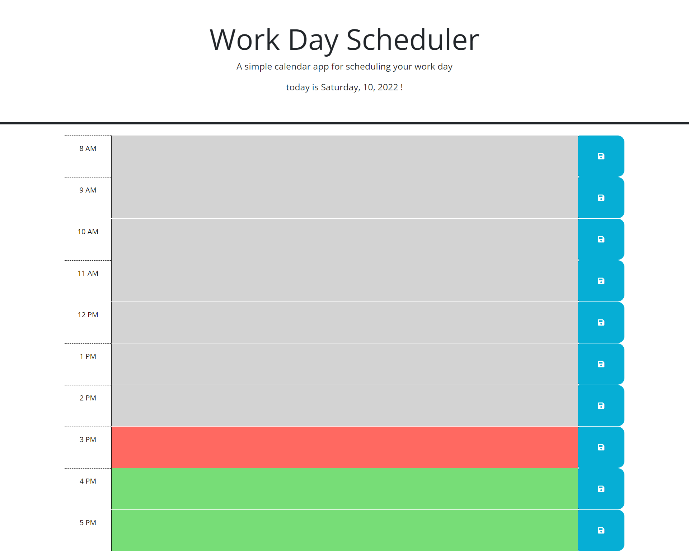

# Bielinski Planner

## Description
My motivation to complete this project was to create an easy way for people to plan their day. I built this project to build on my JavaScript skills and provide an interactive format for intrested parties to keep track of their activites. This project serves as a digital reminder, to people to complete their tasks, without wasting paper. I learned more about the limits of Jquery, when to use vanillia JavaScript and when to use for loops. 

## Installation

N/A

## Usage
The times sections change color based on the current time. To save your tasks, click the save button before leaving the page. the current date is displayed at the top. 

https://lucasbielinski.github.io/bielinski-planner/

## Credits
N/A
## License
N/A
